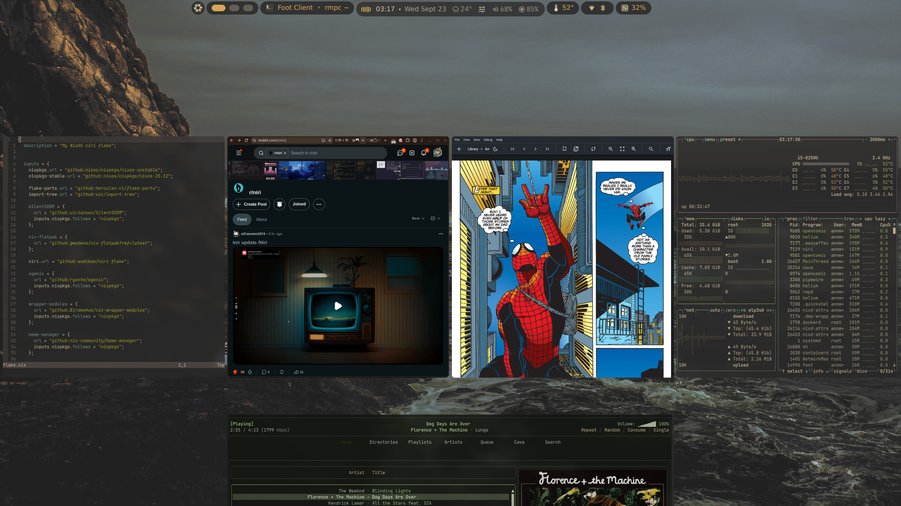
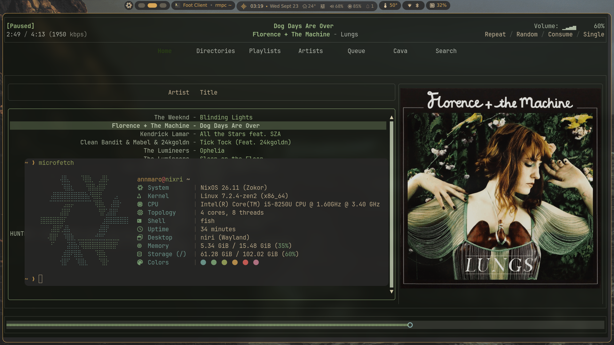
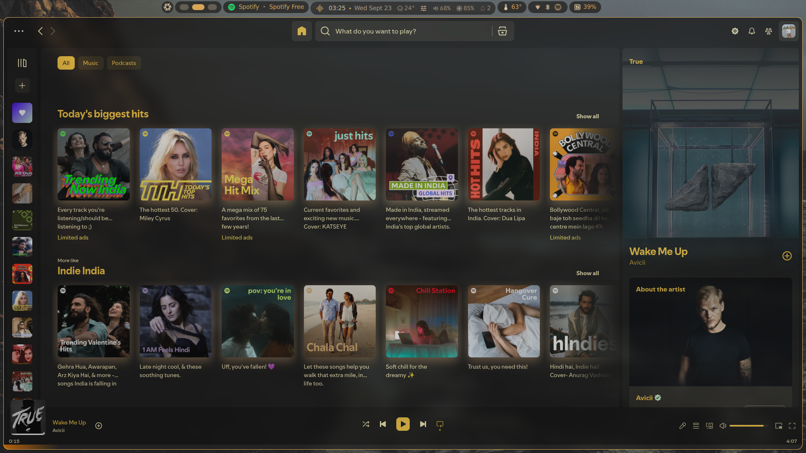
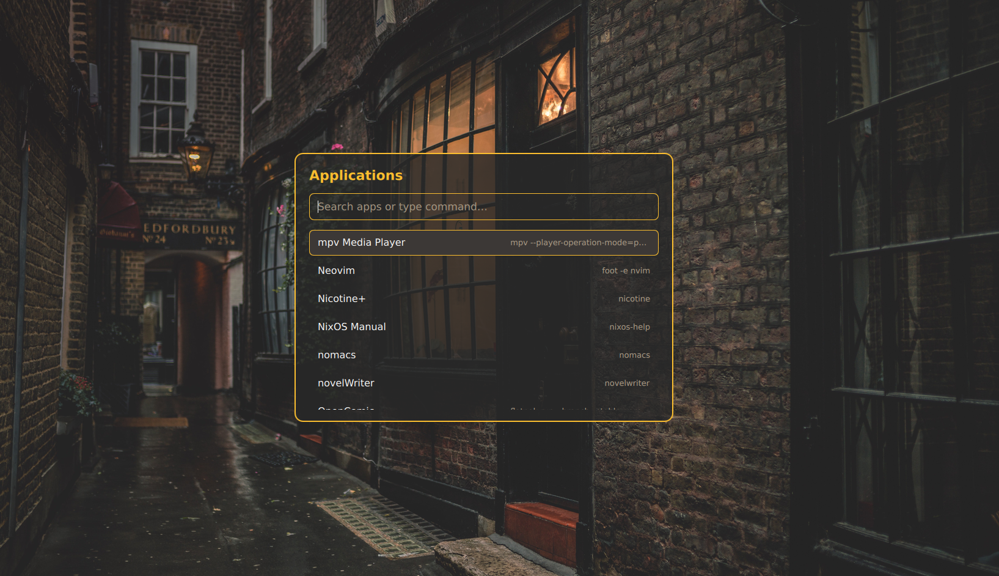

  <p align="center">
  
  </p>

  <p align="center">
    <a href="https://github.com/YaLTeR/niri">
      
    </a>
    <a href="https://github.com/AvengeMedia/DankMaterialShell">
      
    </a>
    <a href="https://github.com/noctalia-dev/noctalia">
      
    </a>
    <a href="https://nixos.org">
      
    </a>
    <a href="LICENSE">
      
    </a>
  </p>

  
  A modular NixOS configuration built around **flake-parts**, **import-tree**, **Home Manager**, and the **Niri** Wayland compositor.
  
  The configuration is designed to keep system modules, user modules, package helpers, data files, and host-specific hardware clearly separated while remaining reusable for additional hosts and users.
- ## Screenshots
  
  [](assets/preview1.png)

  [](assets/preview2.png)

  <details>
  <summary>More screenshots</summary>

  [](assets/preview4.png)

  [](assets/preview6.png)

  </details>

- ## Table of Contents

- [Features](#features)
- [Repository Structure](#repository-structure) 
  - [Import Boundaries](#import-booundaries)
  - [Overlays](#ovrelays)
  - [Niri Configuration](#niri-configuration)
  - [Settings](#settings)
- [Installation](#installation)
- [Secrets](#secrets)
- [Validation](#validation)
- [Rollbacks](#rollbacks)
- [Keybindings](#keybindings)


- ## Features
- NixOS unstable with a locked flake input set.
- `flake-parts` for composing flake-level modules.
- `import-tree` for controlled module discovery.
- Niri Wayland compositor using Sodiboo's cached binaries.
- Fully Nix-native Niri configuration generated by BirdeeHub's Niri wrapper.
- Choice of DMS or Noctalia desktop shell selection.
- Home Manager modules shared across users.
- Typed `systemSettings` and per-user `homeSettings` options.
- Intel laptop and AMD desktop GPU profiles.
- Stylix-based theming.
- Agenix-managed secrets.
- Declarative terminal, editor, CLI, and media apps
- Optional gaming support.
- ## Repository structure
  
  ```text
  .
  ├── flake.nix
  ├── flake.lock
  ├── flake-modules/
  │   ├── devshell.nix
  │   ├── hosts.nix
  │   └── overlays.nix
  ├── hosts/
  │   ├── common.nix
  │   ├── laptop/
  │   │   ├── default.nix
  │   │   └── hardware-configuration.nix
  │   └── desktop/
  │       ├── default.nix
  │       └── hardware-configuration.nix
  ├── modules/
  │   ├── core/
  │   │   └── settings.nix
  │   ├── data/
  │   │   ├── browser/
  │   │   ├── niri/
  │   │   └── terminal/
  │   ├── home/
  │   │   ├── apps/
  │   │   ├── cli/
  │   │   ├── dev/
  │   │   ├── security/
  │   │   └── theming/
  │   ├── nixos/
  │   │   ├── _niri/
  │   │   ├── core/
  │   │   ├── desktop/
  │   │   ├── hardware/
  │   │   └── services/
  │   └── packages/
  │       ├── niri.nix
  │       └── niri-scripts/
  └── secrets/
  ```
- ### Import boundaries
  
  The flake entry point discovers only flake-parts modules:
  
  ```nix
  imports = [ (import-tree ./flake-modules) ];
  ```
  
  NixOS and Home Manager layers are imported separately. Package-producing expressions, helper scripts, raw configuration data, images, and encrypted secrets are kept outside automatically scanned module trees and imported explicitly when needed.
  
  The `_niri` directory contains the larger Niri implementation and is reached through explicit imports from the active Niri selector. It is not treated as a general-purpose automatically discovered module tree.
- ### Overlays
  
  The flake exposes a default overlay from:
  
  ```text
  flake-modules/overlays.nix
  ```
  
  It provides a stable package set alongside unstable Nixpkgs:
  
  ```nix
  pkgs.stable
  ```
  
  It's the place for all of your overlays. Overlays are applied to both host configurations through `hosts/common.nix`.
  
- ## Niri configuration
  
  Niri is configured entirely through Nix. The repository does not contain a hand-written `config.kdl` or raw `programs.niri.config` string.
  
  The configuration is split into two layers:
- `modules/data/niri/settings.nix` contains the reusable Nix attribute set for outputs, workspaces, input, layout, rules, startup commands, and keybindings.
- `modules/packages/niri.nix` supplies those settings to `wrapper-modules.wrappers.niri.wrap`, using Sodiboo's `niri-unstable` package.
  
  The DMS and Noctalia profiles select their own bar-specific bindings while sharing the common Niri settings. The active profile is selected through `systemSettings.bar`.
  
  The flake also enables the `niri.cachix.org` binary cache. The Niri input intentionally does not follow the repository's main nixpkgs revision, preserving compatibility with Sodiboo's cached build.
- ## Settings
  
  System-wide settings are declared in:
  
  ```text
  modules/core/settings.nix
  ```
  
  The main user-facing values include:
- Username and Git identity
- Desktop and bar selection
- Terminal and editor
- Browser and terminal file manager
- Shell
- GPU driver
- Hostname
- Keyboard layout
- 24-hour clock preference
- Gaming support
  
  Host-specific overrides are kept in the host modules. For example, the laptop selects Intel graphics while the desktop selects AMD graphics.
  
  Home Manager receives a translated per-user interface called `homeSettings`. This makes the Home Manager modules reusable for additional users without copying the entire module list.
- ## Installation
  
  This configuration assumes that NixOS has already been installed on the target machine.
- ### 1. Clone the repository
  
  ```bash
  git clone https://codeberg.org/annmaro/nixri.git ~/nixri
  cd ~/nixri
  ```
- ### 2. Inspect available systems
  
  ```bash
  nix flake show
  ```
  
  The current configurations are:
  
  ```text
  nixosConfigurations.laptop
  nixosConfigurations.desktop
  ```
- ### 3. Check host hardware
  
  The laptop hardware configuration contains generated filesystem and device information. For another machine, generate a new hardware configuration and replace the appropriate file:
  
  ```bash
  sudo nixos-generate-config --show-hardware-config > hosts/<host>/hardware-configuration.nix
  ```
  
  Review the generated file before rebuilding, especially filesystem UUIDs, mount points, and boot settings.
- ### 4. Configure the host
  
  Edit the relevant host module:
  
  ```text
  hosts/laptop/default.nix
  hosts/desktop/default.nix
  ```
  
  Use `modules/core/settings.nix` for shared defaults and host modules for hardware-specific overrides.
- ### 5. Rebuild
  
  For the laptop:
  
  ```bash
  sudo nixos-rebuild switch --flake .#laptop
  ```
  
  For the desktop:
  
  ```bash
  sudo nixos-rebuild switch --flake .#desktop
  ```
  
  After installation, you can rebuild with the new hostname using `nh`. Do configure the `nh.nix` at the `modules/nixos/core` directory before using it.
  
  ```bash
  nh os switch --hostname <HOST>
  ```
  Replace `<HOST>` with the name of your host (e.g., `laptop`).
- ## Secrets
  
  Encrypted Agenix files are stored under:
  
  ```text
  secrets/
  ```
  
  The Home Manager Agenix module expects the local identity at:
  
  ```text
  ~/.config/agenix/key.txt
  ```
  
  Do not add plaintext secrets to the repository. Before rebuilding a new machine, make sure the appropriate Agenix identity is available and that the encrypted files are configured for the required recipient keys.
- ## Validation
  
  Parse and inspect the flake:
  
  ```bash
  nix flake show
  ```
  
  Run the complete flake checks:
  
  ```bash
  nix flake check --accept-flake-config
  ```
  
  The flake check validates both host configurations, Home Manager modules, the Nix-generated Niri wrapper configuration, and the package/module boundaries.
  
  Evaluate a host without switching it:
  
  ```bash
  nix eval .#nixosConfigurations.laptop.config.system.build.toplevel
  ```
- ## Rollbacks
  
  List NixOS generations:
  
  ```bash
  list-gens
  ```
  
  Boot into an older generation from the boot menu, or switch to a selected generation with the appropriate NixOS generation command for your system.
- ## Keybindings
  
  The Niri keybindings are maintained as Nix attributes in:
  
  ```text
  modules/data/niri/settings.nix
  ```
  
  They are serialized into the generated Niri configuration by the wrapper. Press `Super+K` to display the available keybindings.

- ## LICENSE

  This project is licensed under the MIT License. See the [LICENSE](./LICENSE.md) file for details.
